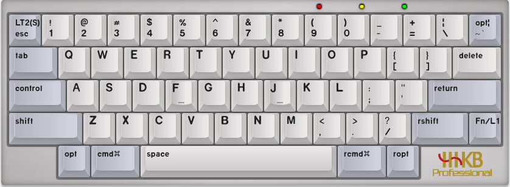
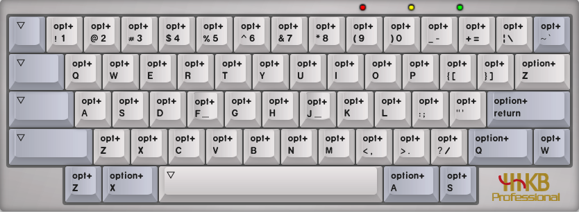

## Start

在去年我曾经写过一篇 2022 年的 nvim 配置方案的博文，那篇文章实际上是本博客访问量最高的，随着时间来到了 2023
年的下半年，nvim 社区也有了新的变化，而随着 [packer](https://github.com/wbthomason/packer.nvim) 插件管理器正式宣布放弃维护，我也不得不投身到了 [lazy](https://github.com/folke/lazy.nvim)
的怀抱，然后说一句，真香！

简单统计了下我使用的插件数量，不知不觉间也来到了 60+，在插件选择，配置上也有了更多自己的想法，增删并定制了特性，
根据我平时编码时的习惯，常用的开发语言做了针对性的优化和设置，在这里分享出来供各位参考。

* 组织良好的配置目录
* 针对 HHKB 键盘的优化
* 手动 LS（language server) 管理
* 采用 [nord](https://github.com/nordtheme/nord) 作为统一的颜色风格
* 便于扩展

话不多说，本文的内容如果对你有启发的话，那就最好不过了！仓库地址在文末！

## From packer to lazy

其实从 [packer](https://github.com/wbthomason/packer.nvim) 迁移至 [lazy](https://github.com/folke/lazy.nvim) 的过程十分简单，一开始可以不用着急使用 lazy 的 lazy
特性。lazy 本身也支持不同的插件组织方式，可以像 packer
一样，将所有的插件放在一个文件中，也可以将插件组织在不同的文件中，形成文件树。当然，组织成文件树有着非常多的优势，我的
nvim config 也正采用了这一方案，对插件进行了简单分类，可以非常方便的对插件进行变更。

## Config structure

目录结构很简单，入口文件为最外层的 `init.lua`,所有主要的配置文件都放在 lua 目录下

* `plugin.lua` 是 lazy.nvim 插件管理器的配置入口文件
* `plugins` 存放 lazy 所管理的所有插件以及有关的配置，并对插件进行了分类，放在了不同的子目录中
* `autocmds.lua` 中有一些自动执行的脚本
* `basic.lua` 中包含一些 nvim 的基本配置，与插件无关
* `keymaps.lua` 中包含一些快捷键的配置，这些快捷键和插件无关
* `neovide.lua` 中存放和 neovide 这个 nvim 的 GUI 有关的配置
* `rikka.lua` 是我 nvim 中统一的辅助类库，我的一些辅助函数，都会放在这个文件中

```txt
config
├── after
│  └── ftplugin
├── ftdetect
├── lua
│  ├── plugins
│  │  ├── common
│  │  ├── git
│  │  ├── lsp
│  │  │  ├── server
│  │  ├── theme
│  │  ├── treesitter
│  │  ├── ui
│  │  └── init.lua
│  ├── autocmds.lua
│  ├── basic.lua
│  ├── keymaps.lua
│  ├── neovide.lua
│  ├── plugin.lua
│  └── rikka.lua
├── init.lua
├── lazy-lock.json
└── README.md
```

## Plugins

这里不打算对 `plugins` 目录下的每个插件进行详细的介绍，每个插件的作用和功能都可以在插件本身的仓库中找到，同时也可以使用
help 命令查看相应的帮助文档。和具体某一插件相关的配置 (非默认配置/快捷键等)，都在同一个文件中。
我在选择插件时并不拘泥于是否是纯 lua 编写，很多经典的 vim 插件都可以在 nvim
中工作良好，并且久经考验，不能因噎废食。

在 LSP 相关的配置中，我没有使用 [mason](https://github.com/williamboman/mason.nvim)，而选择了使用在 nvim-lspconfig 自行的对 language server
进行安装和管理，这虽然会带来些许的麻烦，但是有着更为清晰明了的配置格式和代码结构。也让我的 nvim
配置中不存在复杂的地方。

在代码补全方面，依然使用 [nvim-cmp](https://github.com/hrsh7th/nvim-cmp) , 按键习惯参考了 Jetbrains
家产品的快捷键风格（仅代码补全部分），使用起来还是非常舒服的。

## Rikka

`rikka.lua` 封装了我在 nvim 配置中的一些重复逻辑和通用的变量，可以在任何地方使用。将其命名为 `rikka`,
只是我个人的小小爱好，配置中由我定义的所有的 keymap/autocmd 等，全部通过 `rikka.setKeymap`
来完成，进而可以在未来对这些 keymap/autocmd 进行更多的统一的优化和调整。

## HHKB optimize

在之前的[博文](/post/hhkb/)中，介绍了我的 HHKB 和 keybindings，整体的使用逻辑没有变化，但是在更换了 HHKB 的主控为
[ydkb](https://ydkb.io) 之后，键盘的配置也有了更多的可能性，下面直接放出我的 HHKB 键位图。

### L0 的配置

`<ESC>` 键在长按时映射到了 L2 层，此时按下的键就是 L2 层对应的键，最右上角的 `~` 在长按时被映射到 Option 键。



### L2 的配置

L2 层的配置非常简单，简单来说，任何单一按键就是 Option + 该按键的组合键，几个原来作为 Prefix 的键略有不同。



这样做的效果就是，我有三个键都是等效的 Option 键，而在 nvim 中，所有的组合式的快捷键，我都会选择使用 `<M->`, 也就是 macOS 上的 Option 键。
这样既解决了 `<M>` 的跨平台问题，也解决了原本的 `<M>` 键左下角的位置不好按的问题，在搭配左手按键的时候会可以使用最右上角的 `~` 作为等效的 `<M>` 使用。

{}
## Inspired by
+ [Zwlin's nvim config](https://github.com/Zwlin98/nvim)
{}
