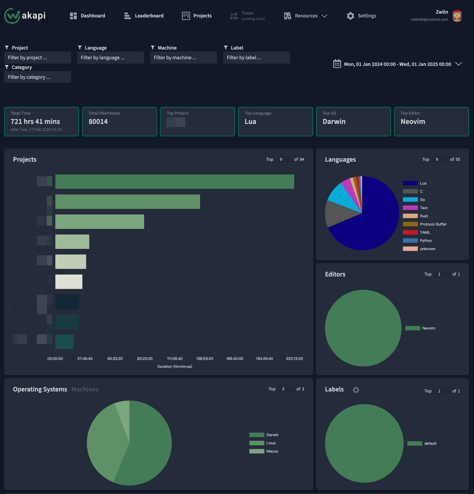
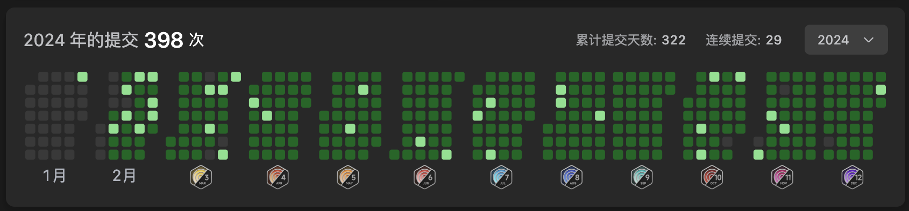

2025 年 1 月 1 日，我和往常一样打开了我的 RSS 订阅目录，大部分文章的主题很简单 - 年终总结，让我对 2024 年一年的结束，有了更深的触动，读了许多博主的总结文章，有羡慕，有的感动。回想起我上次写的年终总结还是 2020 年的展望，而今年是我正式成为打工人的完整一年，感觉这一年还是有很多成长的，也想写一篇文章回顾和展望一下。
## Coding

作为一个游戏开发者，不用说，今年做的最多的一件时间，就是写代码。我部署了 [muety/wakapi](https://github.com/muety/wakapi) 作为自己的开发数据统计，其中的排名前五的（均已打码隐藏）都是公司业务相关的代码，剩下的是一些阅读开源项目源码的统计，包括 Skynet / Redis 等，这也是 C 语言排在我使用的语言的第二的原因。

我的编辑器是纯粹的 neovim，几乎全部的编码工作都通过 neovim 完成，经过长时间的磨合，我的 neovim 配置也趋于稳定，不再有大幅度的调整，只会时不时的增加一些新的脚本，来适配我的开发工作。

开发时使用的操作系统也很纯粹，60% 的 macOS 加上 40 % 的 Linux，顺带一提，我现在已经完全不使用 Linux 的任何桌面环境了，本科时期曾经折腾过很多的 Linux 桌面环境，也用了很久，但是说实话，Linux 的桌面环境真的不是很适合长久使用，总是会出现各种各样的小问题。因此我现在只使用 SSH + neovim 在 Linux 上进行远程开发，把 MacBook 作为 Linux 的跳板机器使用，我的 Linux 也不会安装任何的 DE。

{}

不过幸好有补签卡，偶尔还是有时候会忙到没时间做题的

{}

即使工作了，我也希望尽可能保持住做算法题的感觉，LeetCode 的每日一题，是非常好的练习机会。我从 2024 年 2 月开始重新做每日一题，拿满了从 3 月到 12 月的每月勋章，看着这个打卡记录，还是充满了成就感的！

## Learning

今年在工作之余的空闲时间，也不忘记学习有意思的东西给自己充电，其中主要是阅读源代码，比较印象深刻的包括但不限于：

1. **深入研究 Skynet**: 读完了 [Skynet](https://github.com/cloudwu/skynet) 的源码，彻底理解了其设计思路，并在公司内部进行了一次关于 Skynet 原理的技术分享。同时，我开发并开源了 [moon](https://github.com/Zwlin98/moon)，作为 Skynet 的辅助工具。在公司内部，一些服务已经完全由 moon 承载，其稳定性和性能表现出色。

2. **探索 Lua 的核心实现**: 阅读了部分 [Lua](https://www.lua.org/download.html) 的源码，理解了其设计思想、与 C 的集成方式，以及 Lua 中 coroutine 的实现原理。Skynet 的 Lua 部分对 coroutine 的精巧运用让我印象深刻。随着对 Lua 代码的深入了解，我愈发感受到它是一门充满天才设计的语言：在如此小的代码体量中，几乎实现了现代编程语言的所有核心特性。关于 Lua，还有许多值得学习和研究的地方。

3. **Redis 与 epoll 的再思考**: 阅读了 [Redis 5.0](https://github.com/redis/redis/tree/5.0.14) 的部分源码，尤其是网络 I/O 部分，发现其设计思路与 Skynet 有异曲同工之妙。类似的设计还体现在 Go 语言的 `netpoller` 模块中，核心都围绕对 `epoll` 系统调用的高效运用。曾经对 `epoll` 半知半解，而通过研究这些工业级代码，我逐渐理解了它的设计精髓。

   {}
   jyy 老师的 B 站账号「绿导师原谅你了」也因此成为了我 B 站今年总结的年度挚爱...
   {}

4. **对操作系统的认识突破**: 完成了 [MIT 6.1810](https://pdos.csail.mit.edu/6.1810/2024/xv6.html) xv6 实验的一大半，后续因时间原因暂时搁置。配合 jyy 老师的[南京大学操作系统](https://www.bilibili.com/video/BV1Xm411f7CM/)课程，我对操作系统的理解得到了质的提升。课程贯穿始终的状态机概念以及对 AI 的拥抱，充分展现了技术的魅力，给了我莫大的鼓舞。强烈推荐所有对操作系统感兴趣的人重温这门课程！

5.  **KCP 的设计精髓**: 读完了 [kcp](https://github.com/skywind3000/kcp) 的源码以及 [kcp-go](https://github.com/xtaci/kcp-go) 中的实现部分。通过 KCP 的阅读，我对 TCP 的理解更加深入。KCP 的 RTO 计算和拥塞控制参考了 TCP，以 UDP 的方式，通过简洁而精巧的代码实现了类似 TCP 的 ARQ 协议。
   
6. **深入理解 Raft**: 重读了多遍 [Raft](https://raft.github.io/raft.pdf) 论文，这次结合 [[Implementing Raft](https://eli.thegreenplace.net/2020/implementing-raft-part-0-introduction/)] 系列文章，终于算是彻底理解了 Raft 的设计思路。下一步计划是研究工业界对 Raft 的实际实现。

7. **用户态网络栈的初步探索**: 研究了大量 VPN 和代理软件的实现原理，对 tun/tap 设备的机制产生了浓厚的兴趣。目前已经初步阅读了 [tun2socks](https://github.com/xjasonlyu/tun2socks) 和 [wireguard-go](https://github.com/WireGuard/wireguard-go) 的部分代码，对网络栈的理解仍在持续深入。

8. **日语的学习**: 坚持多邻国打卡，2024 年一天都没有落下！

## Living

今年的生活整体比较平淡，没有太多的旅行安排，也没有经历轰轰烈烈的大事件。虽然如此，我却很享受这种平静的节奏。正如前几天从一位博友的文章中读到的一句话所说：

> Travel itself doesn’t bring happiness—true happiness should come from a stress-free life.

虽然没有大起大落，但平凡的日常中，总有一些小细节让人感到温暖和满足，这种平淡的生活也有其独特的魅力。

1. 女朋友的工作终于顺利调动到了杭州，每天都可以和自己喜欢的人一起吃饭、聊天、散步。结束了以往大部分时间只能通过聊天软件和视频联系的日子，现在每天都充满了真实的陪伴和温暖，这种幸福感真是无法用言语完全描述！
2. 和女朋友一起去了三亚，那里的蓝天干净透亮，大海一望无际，风景非常迷人。我们沿着柔软的沙滩散步，脚踩在细腻的沙子上，感受着自然的舒适，海风吹过，带着些许咸咸的味道，让人觉得非常惬意。
3. 拥有了人生中的第一辆汽车，领克 08 EMP。从 8 月底提车到现在，已经累计行驶了 3000 多公里。这辆车的整体表现让我满意，不管是驾驶体验、配置还是外观设计。有了车之后，出行的自由度大大提高了，想去哪里就能说走就走，这种便利性带来的幸福感是之前无法体会的。

## Future

2024 年悄然结束，回顾这一年，整体来说还是让人满意的。在工作和技术生涯中，我取得了不少进步，不仅技能上有所提升，也渐渐爱上了阅读优秀的开源代码，从中能学到了许多设计理念和解决问题的思路。同时，我的博客文章在质量上也有所提高，尽管产量还有些不足，但每一篇都更加用心，努力做到内容扎实、有价值。

展望 2025，希望比 2024 更进一步，在各个方面得到成长， 如果说要定一些具体的目标（工作进步之外）的话，那么我希望：

1. 更多的参与开源项目，成为贡献者，甚至成为 member / maintainer
2. 更多的锻炼和健身，摆脱亚健康状态，有一个健康的身体
3. 更多的学习一切感兴趣的内容，将学到的东西，写成博客，产出高质量的文章
4. 继续保持每天刷题，保持多邻国打卡
