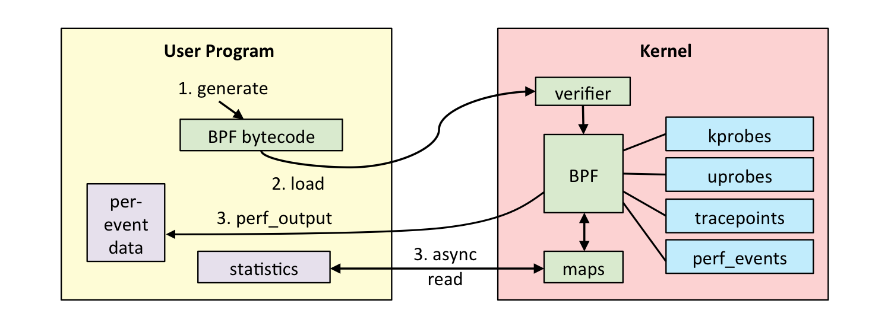

## ebpf 是什么？

对于我来说，最让我感到豁然开朗的解释的是 Brendan Gregg 大师在其[博文](https://www.brendangregg.com/blog/2019-01-01/learn-ebpf-tracing.html)中提到的：

> **eBPF** does to Linux what JavaScript does to HTML.(Sort of.) … In reality, eBPF is more like the v8 virtual machine that runs JavaScript, rather than JavaScript itself. eBPF is part of the Linux kernel.

实际上我看了很多对于 ebpf 的 *[正式](https://ebpf.io/what-is-ebpf#what-is-ebpf)* 释义依旧云里雾里，大师的解释让我对于 ebpf 一下子不再心怀畏惧：认为其需要高深的 Linux 内核知识，需要充分的内核知识储备。

之后我就开始了我的 ebpf 体验之旅，发现确实以我对于 Linux 内核粗浅的认识，一样可以使用 ebpf (当然也得益于 [bcc](https://github.com/iovisor/bcc) 这一好用的工具)，因此记录下我在了解和学习 ebpf / bcc 过程中踩的一些坑。

## BPF Compiler Collection (BCC)

BCC 是一个 BPF 编译器集合，包含了用于构建 BPF 程序的编程框架和库，并提供了大量可以直接使用的工具。

> BCC makes BPF programs easier to write, with kernel instrumentation in C (and includes a C wrapper around LLVM), and front-ends in Python and lua. It is suited for many tasks, including performance analysis and network traffic control.

如何安装以及环境配置等问题就不多提了，我使用的是 Arch Linux，可以在 [Installing BCC](https://github.com/iovisor/bcc/blob/master/INSTALL.md) 上查看如何在各种 Linux 发行版上安装 BCC (对内核要求较高)。

## 一个 ebpf 程序

```python
#!/usr/bin/env python3
from bcc import BPF

ebpf_c_text = """
int kprobe__sys_clone(void *ctx)
{
    bpf_trace_printk("Hello, World!\\n");
    return 0;
}
"""

b = BPF(text=ebpf_c_text)
print("Your first ebpf Program... Ctrl-C to stop")
try:
    b.trace_print()
except KeyboardInterrupt as e:
    exit()
```

这个程序稍微改造了一下 [bcc Python Developer Tutorial](https://github.com/iovisor/bcc/blob/master/docs/tutorial_bcc_python_developer.md) 的第一个例程，在刚开始学 ebpf 时，我对这个例程感到非常疑惑，仿佛回到了刚学编程的那个时候。可以看出，这里内嵌了一个 C 代码，然后程序本体是 Python 代码，然后这个 `kprobe__sys_clone` 函数的声明也很让人摸不着头脑。

实际上搞懂这些首先需要知道 ebpf 程序是如何开发然后载入内核并执行的，如图所示：



1. 使用 C 语言开发一个 eBPF 程序；
2. 借助 LLVM 把 eBPF 程序编译成 BPF 字节码；
3. 通过 bpf 系统调用，把 BPF 字节码提交给内核；
4. 内核验证并运行 BPF 字节码，并把相应的状态保存到 BPF maps 中；
5. 用户程序通过 BPF maps 查询 BPF 字节码的运行状态。

当然这几步你可以手动去完成，但是显然 BCC 抽象了这一过程，例程中只要完成第 1 步和第 5 步即可。这里的 ebpf_c_text 就是 C 开发的一个 eBPF 程序，之后就是 BCC 来完成第 2/3 步，用 Python 完成数据的读取 (当然这里还没有用到 bpf 的 maps)。到此为止，这个 Python 程序的大题框架我们已经认识。还有一些细节我们没理解。我们先看看运行结果：

```bash
chmod +x first_ebpf.py
./first_ebpf.py #需要root权限或 sudo ./first_ebpf.py
```

Output：

```text
Your first ebpf Program... Ctrl-C to stop
b'             zsh-27651   [024] d..31 184376.953730: bpf_trace_printk: Hello, World!'
b'             zsh-27651   [024] d..31 184377.212267: bpf_trace_printk: Hello, World!'
...
^C
```

我们知道，clone 是创建子进程系统调用，因此当有进程创建子进程，例如输入 ls 命令，就会触发这个 ebpf 程序。输出如上所示。

剩下的问题就是理解程序到底做了什么 ([文档链接](https://github.com/iovisor/bcc/blob/master/docs/reference_guide.md))：

+ `int kprobe__sys_clone(void *ctx)`：

    > `kprobe__` is a special prefix that creates a kprobe (dynamic tracing of a kernel function call) for the kernel function name provided as the remainder。You can also use kprobes by declaring a normal C function，then using the Python `BPF.attach_kprobe()` (covered later) to associate it with a kernel function。
    >
    > Arguments are specified on the function declaration：kprobe__*kernel_function_name*(struct pt_regs *ctx [,*argument1* ...])
    >
    > The first argument is always `struct pt_regs *`，the remainder are the arguments to the function (they don't need to be specified，if you don't intend to use them)。
    >
    > kprobe__ 是一个特殊的前缀，用来追踪其后缀代表的内核函数调用，其第一个参数固定为 `struct pt_regs *ctx`，其余参数是待追踪的函数的参数 (如果不打算使用它们，则不需要指定它们)。

+ `bpf_trace_printk()`：

    > `bpf_trace_printk` is a simple kernel facility for printf() to the common trace_pipe (/sys/kernel/debug/tracing/trace_pipe)。
    >
    > 可以把 `bpf_trace_printk()` 简单理解为 ebpf 专用的 printf，但是有许多限制，一般只在调试时使用 (参考文档)

+ `BPF()`

    > Creates a BPF object。This is the main object for defining a BPF program，and interacting with its output。
    >
    > 创建一个 BPF 对象，完成上述的第 2/3 步。

+ `b.trace_print()`

    > This method continually reads the globally shared /sys/kernel/debug/tracing/trace_pipe file and prints its contents。
    >
    > trace_print() 持续读取全局共享的 /sys/kernel/debug/tracing/trace_pipe 文件并打印其内容。显然该方法是对应 `bpf_trace_printk()` 的用户态程序，ebf 在内核写入到 trace_pipe，python 程序在用户态不停的读取。

这几个核心的函数解释完成，程序的逻辑也就不难理解了：每当 `sys_clone` 被调用，ebpf 程序输出一个 `Hello World` 到 `trace_pipe`，然后 `Python` 持续读取 `trace_pipe` 并输出。

### 待续…

## Inspired by
{}
[eBPF Documentation: What is eBPF?](https://ebpf.io/what-is-ebpf)

[Learn eBPF Tracing: Tutorial and Examples](https://www.brendangregg.com/blog/2019-01-01/learn-ebpf-tracing.html)

[bcc Reference Guide](https://github.com/iovisor/bcc/blob/master/docs/reference_guide.md)
{}
