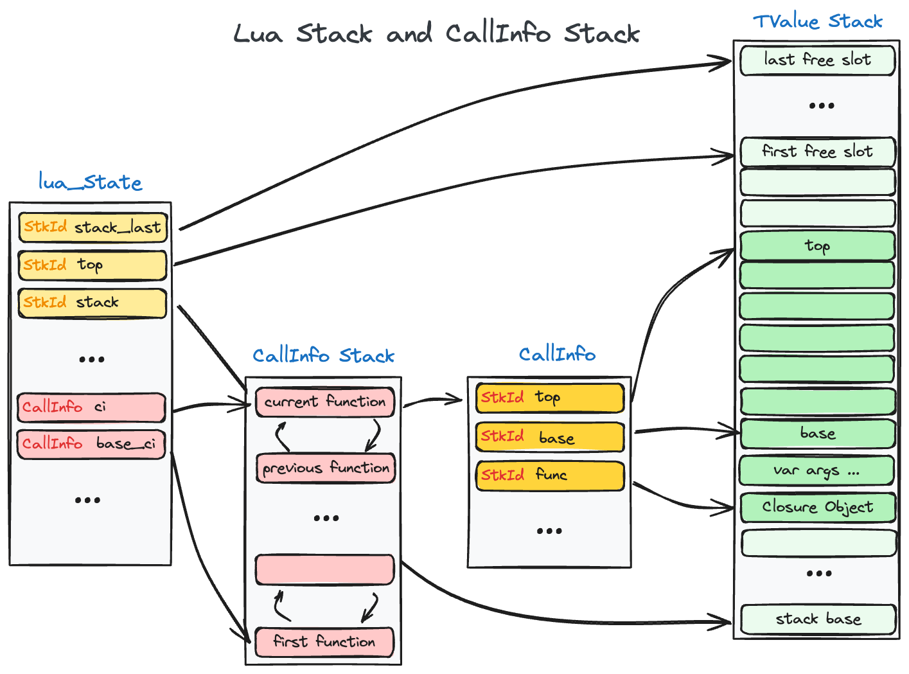

## 管中窥豹：从 Lua 调用 C

请先允许我复制并简单翻译下 Lua5.3 的官方文档中和栈相关的几个关键内容，文档的描述非常的精练，个人实在是不能描述的比文档更好了，所以请读者能原谅我这无耻的复制粘贴行为。由于我司目前的 Lua 环境仍旧是 Lua5.3，故以 Lua5.3 的源码作为实现的分析来源，实际上，我也对比了这一部分内容在 Lua5.4 中的相关实现，逻辑并没有大的变化，只是有一些数据结构定义上的变化和重构，因此以 Lua5.3 进行源代码的分析并不算过时。

> ## 4.1 The Stack
>
> Lua uses a *virtual stack* to pass values to and from C. Each element in this stack represents a Lua value (nil, number, string, etc.). Functions in the API can access this stack through the Lua state parameter that they receive.
>
> Lua 使用一个 *虚拟栈* 来和 C 互传值。栈上的的每个元素都是一个 Lua 值（nil，数字，字符串，等等）。
>
> Whenever Lua calls C, the called function gets a new stack, which is independent of previous stacks and of stacks of C functions that are still active. This stack initially contains any arguments to the C function and it is where the C function can store temporary Lua values and must push its results to be returned to the caller (see [`lua_CFunction`](https://www.lua.org/manual/5.3/manual.html#lua_CFunction)).
>
> 无论何时 Lua 调用 C，被调用的函数都得到一个新的栈，这个栈独立于 C 函数本身的栈，也独立于之前的 Lua 栈。它里面包含了 Lua 传递给 C 函数的所有参数，而 C 函数则把要返回的结果放入这个栈以返回给调用者（参见 [`lua_CFunction`](https://cloudwu.github.io/lua53doc/manual.html#lua_CFunction)）。
>
> For convenience, most query operations in the API do not follow a strict stack discipline. Instead, they can refer to any element in the stack by using an *index*: A positive index represents an absolute stack position (starting at 1); a negative index represents an offset relative to the top of the stack. More specifically, if the stack has *n* elements, then index 1 represents the first element (that is, the element that was pushed onto the stack first) and index *n* represents the last element; index -1 also represents the last element (that is, the element at the top) and index *-n* represents the first element.
>
> 方便起见，所有针对栈的 API 查询操作都不严格遵循栈的操作规则。而是可以用一个 *索引* 来指向栈上的任何元素：正的索引指的是栈上的绝对位置（从 1 开始）；负的索引则指从栈顶开始的偏移量。展开来说，如果堆栈有 *n* 个元素，那么索引 1 表示第一个元素（也就是最先被压栈的元素）而索引 *n* 则指最后一个元素；索引 -1 也是指最后一个元素（即栈顶的元素），索引 *-n* 是指第一个元素。
>
> ### lua_CFunction
>
> `typedef int (*lua_CFunction) (lua_State *L);`
>
> Type for C functions.
>
> C 函数的类型。
>
> In order to communicate properly with Lua, a C function must use the following protocol, which defines the way parameters and results are passed: a C function receives its arguments from Lua in its stack in direct order (the first argument is pushed first). So, when the function starts, `lua_gettop(L)` returns the number of arguments received by the function. The first argument (if any) is at index 1 and its last argument is at index `lua_gettop(L)`. To return values to Lua, a C function just pushes them onto the stack, in direct order (the first result is pushed first), and returns the number of results. Any other value in the stack below the results will be properly discarded by Lua. Like a Lua function, a C function called by Lua can also return many results.
>
> 为了正确的和 Lua 通讯，C 函数必须使用下列协议。这个协议定义了参数以及返回值传递方法：C 函数通过 Lua 中的栈来接受参数，参数以正序入栈（第一个参数首先入栈）。因此，当函数开始的时候， `lua_gettop(L)` 可以返回函数收到的参数个数。第一个参数（如果有的话）在索引 1 的地方，而最后一个参数在索引 `lua_gettop(L)` 处。当需要向 Lua 返回值的时候，C 函数只需要把它们以正序压到堆栈上（第一个返回值最先压入），然后返回这些返回值的个数。在这些返回值之下的，堆栈上的东西都会被 Lua 丢掉。和 Lua 函数一样，从 Lua 中调用 C 函数也可以有很多返回值。
>
> As an example, the following function receives a variable number of numeric arguments and returns their average and their sum:
>
> 下面这个例子中的函数将接收若干数字参数，并返回它们的平均数与和：
>
> ```c
> static int foo (lua_State *L) {
>  int n = lua_gettop(L);    /* number of arguments */
>  lua_Number sum = 0.0;
>  int i;
>  for (i = 1; i <= n; i++) {
>    if (!lua_isnumber(L, i)) {    
>      lua_pushliteral(L, "incorrect argument");
>      lua_error(L);
>    }
>    sum += lua_tonumber(L, i);
>  }
>  lua_pushnumber(L, sum/n);        /* first result */
>  lua_pushnumber(L, sum);         /* second result */
>  return 2;                   /* number of results */
> }
> ```

我在读完文档之后，还是有很多的疑惑：

1. Lua 提供的 API 基本上都围绕 Virtual Stack 所设计，但是这个 Virtual Stack 到底代表了什么？既然取名为 Stack，那么这个 Stack 和 Lua 的运行时的堆栈有什么关系？Lua 为什么要这么设计？
2. 第二段中提到，无论何时 Lua 调用 C，被调用的函数都得到一个新的栈，这又是如何做到的？这样做不会有很大的性能代价吗？
3. 从给出的 C 例程看，从 Lua 代码中传入的参数，被依次压入到 Lua 提供的 Virtual Stack 中，C 层需要返回给 Lua 层的结果也被依次的压入该 Virtual Stack, 该函数在将结果推入栈之前不需要对栈进行额外的处理，这又是如何做到的？

{}

And, you know, reading the source is of course the only way to enlightenment. 这句话摘自 LuaJIT 文档中的 [FAQ](https://luajit.org/faq.html), 可谓是振聋发聩。

{}

Lua 的文档十分精练，可以说是点到为止，并不足以解决我的困惑，接下来，就让我们开启对源代码的探索之旅，揭开 Lua Stack 的神秘面纱吧！

## 一探究竟：深入源码

{}

在学习 Lua 的源码实现时，发现了一门非常有意思的课程 [Run-Time Systems](https://www.cs.tufts.edu/comp/250RTS/)，里面的关于 Lua 的课程讲义，帮助了我很多，有兴趣的朋友也可以去瞧瞧。

{}

可以看到，`lua_State` 这个结构体是用户和 Lua 交互的一个最重要的对象，从名字上看，它表示的是一个 Lua 程序的执行状态，不过本文关注的重点是 `lua_State` 和 Virtual Stack 相关的部分。

`lua_State`中主要维护了两个栈。

1. 数据栈：是 `TValue` 对象的数组。`Callinfo` 对象索引到这个数组中。 *Registers are basically slots in the L->stack array*.
2. 调用栈：是 `Callinfo` 构成的一个双向链表，用来跟踪函数的调用栈 (activation frames)。




根据我对 Lua 中两种 stack 的理解，绘制了这个大概的引用关系，不是特别精确，因为 Lua 不单纯是一门虚拟机语言，更是作为一门嵌入式语言而存在，C 和 Lua 互相调用也是常态，这里只给出 Lua 部分的堆栈变化，而 C 会对这些堆栈会产生什么影响，要等到讲到 Lua 的 Coroutine 才行。

### lua_State

```c
struct lua_State {
  CommonHeader;
  unsigned short nci;  /* number of items in 'ci' list */
  lu_byte status;
  StkId top;  /* first free slot in the stack */
  global_State *l_G;
  CallInfo *ci;  /* call info for current function */
  const Instruction *oldpc;  /* last pc traced */
  StkId stack_last;  /* last free slot in the stack */
  StkId stack;  /* stack base */
  UpVal *openupval;  /* list of open upvalues in this stack */
  GCObject *gclist;
  struct lua_State *twups;  /* list of threads with open upvalues */
  struct lua_longjmp *errorJmp;  /* current error recover point */
  CallInfo base_ci;  /* CallInfo for first level (C calling Lua) */
  volatile lua_Hook hook;
  ptrdiff_t errfunc;  /* current error handling function (stack index) */
  int stacksize;
  int basehookcount;
  int hookcount;
  unsigned short nny;  /* number of non-yieldable calls in stack */
  unsigned short nCcalls;  /* number of nested C calls */
  l_signalT hookmask;
  lu_byte allowhook;
};
```

`lua_State` 代表了 Lua 中的一个线程 (Lua 中的线程，指的就是一个 Coroutine)，是暴露给用户的数据类型。从名字上看，它想表示一个 Lua 程序的执行状态，在官方文档中，它指代 Lua 的一个线程。每个线程拥有独立的数据栈以及函数调用链，还有独立的调试钩子和错误处理设施。

所以我们不应当简单的把 lua_State 看成一个静态的数据集，它是一组 Lua 程序的执行状态机。所有的 Lua C API 都是围绕这个状态机，改变其状态的：或把数据压入堆栈，或取出，或执行栈顶的函数，或继续上次被中断的执行过程。

`top`, `stack`, `stack_last` 都是和数据栈有关的变量，维护了栈的大小，以及当前的栈顶和栈底所在的位置。

`ci`, `base_ci` 则是和程序调用栈有关的变量，`base_ci` 可以理解为调用栈这一双向链表的头，`ci` 即双向链表的尾部，也是指向了当前正在执行的函数。

###  TValue & StkId

```c
/*
** Union of all Lua values
*/
typedef union Value {
  GCObject *gc;    /* collectable objects */
  void *p;         /* light userdata */
  int b;           /* booleans */
  lua_CFunction f; /* light C functions */
  lua_Integer i;   /* integer numbers */
  lua_Number n;    /* float numbers */
} Value;

#define TValuefields	Value value_; int tt_

typedef struct lua_TValue {
  TValuefields;
} TValue;

typedef TValue *StkId;  /* index to stack elements */
```

Lua 中的数据可以这样分为两类：值类型和引用类型。值类型可以被任意复制，而引用类型共享一份数据，由 GC 负责维护生命期。Lua 使用一个联合 union Value 来保存数据。

而 Lua 的数据栈，就只是由 TValue 构成的数组而已，而任何 Lua 中的对象，都可以存放在该数组中。

### CallInfo

```c
typedef struct CallInfo {
  StkId func;  /* function index in the stack */
  StkId	top;  /* top for this function */
  struct CallInfo *previous, *next;  /* dynamic call link */
  union {
    struct {  /* only for Lua functions */
      StkId base;  /* base for this function */
      const Instruction *savedpc;
    } l;
    struct {  /* only for C functions */
      lua_KFunction k;  /* continuation in case of yields */
      ptrdiff_t old_errfunc;
      lua_KContext ctx;  /* context info. in case of yields */
    } c;
  } u;
  ptrdiff_t extra;
  short nresults;  /* expected number of results from this function */
  unsigned short callstatus;
} CallInfo;
```

Lua 把调用栈和数据栈分开保存。调用栈放在一个叫做 Calllnfo 的结构中，以双向链表的形式储存在线程对象里。

CallInfo 保存着正在调用的函数的运行状态。部分数据和函数的类型有关，以联合形式存放。C 函数与 Lua 函数的结构不完全相同。CallInfo 中还保存当前运行的函数在数据栈中对应的 base，top 等。

## 抽丝剥茧：关键的函数

## 茅塞顿开：Lua 的 API 缘何如此设计？ 

{}

## Inspired by

- [Discussion questions for Lua call stacks](https://www.cs.tufts.edu/comp/250RTS/handouts/1018luastack.html)
- [Lua 5.3 Reference Manual 4.1- 4.3](https://www.lua.org/manual/5.3/manual.html#4.1)
- [lua/lua: The Lua development repository](https://github.com/lua/lua/)
- [Programming in Lua (third edition)](https://www.lua.org/pil/contents.html)
- [Lua 源码欣赏](https://www.codingnow.com/download/readinglua.pdf)

{}
