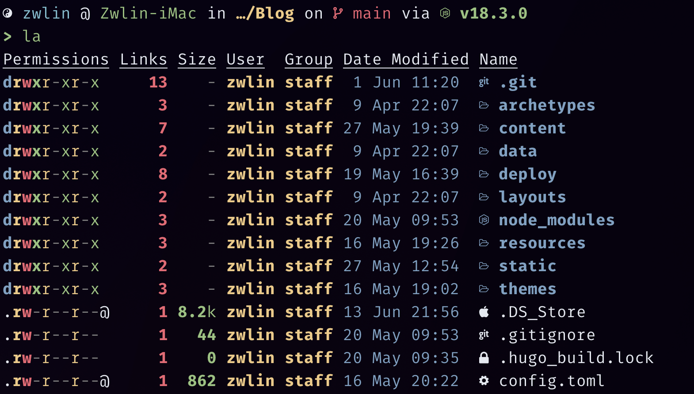
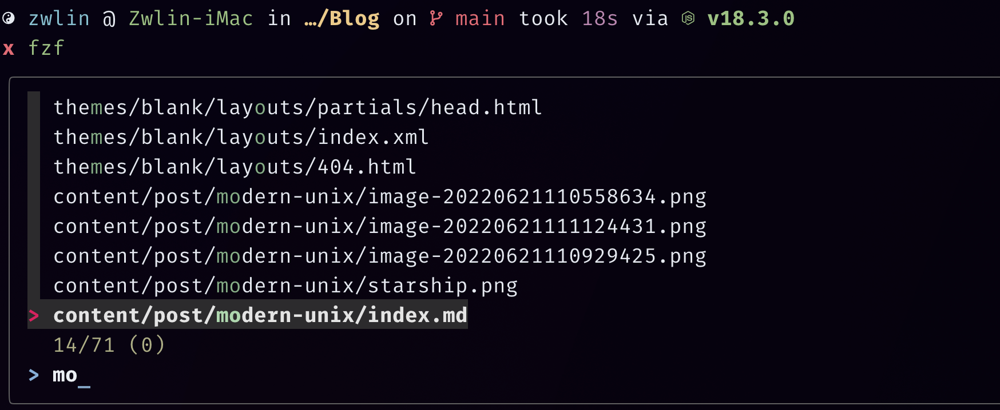
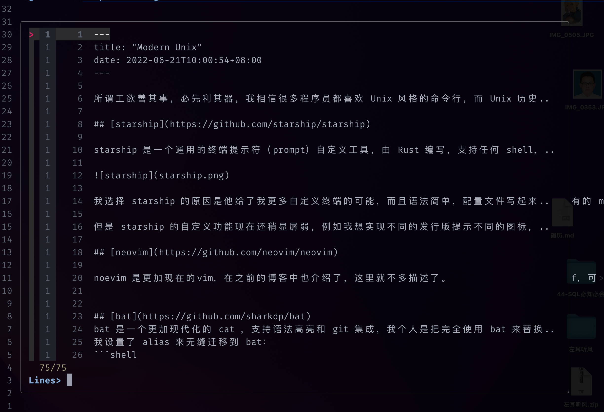

所谓工欲善其事，必先利其器，我相信很多程序员都喜欢 Unix 风格的命令行，而 Unix 历史久远， 很多 Unix 上的命令行工具都有了更加 Modern 的替代品，其中由 Rust/Go 编写的命令行工具，更成了这类工具的主流， 它们要么速度更快，要么更加“花里胡哨”。这篇文章打算介绍一些我正在使用的 Modern Unix 工具以及我的终端环境。

## [starship](https://github.com/starship/starship)

starship 是一个通用的终端提示符（prompt）自定义工具，由 Rust 编写，支持任何 shell，包括 Windows 上的 Powershell，用法很简单，有一点小要求就是你的终端需要支持 [Nerd Font](https://github.com/ryanoasis/nerd-fonts/tree/gh-pages)，我用 starship 定制了一个仿 ohmyzsh 的 ys 主题，预览效果如下：


我选择 starship 的原因是他给了我更多自定义终端的可能，而且语法简单，配置文件写起来也毫无障碍，我不喜欢 ys 主题的 git status 功能，而且我想给我的终端加上 Haskell 的提示，这些都可以通过 starship 做到。

但是 starship 的自定义功能现在还稍显孱弱,当我想实现不同的发行版提示不同的图标，这一点在 Powerlevel10k 可以做到，但是 statrship 就暂时没有办法很方便的配置（[相关issue](https://github.com/starship/starship/issues/3251)），我也很期待 starship 未来的开发。

## [neovim](https://github.com/neovim/neovim)

noevim 是更加现在的 vim，在之前的博客中也介绍了，这里就不多描述了。


## [bat](https://github.com/sharkdp/bat)
bat 是一个更加现代化的 cat ，支持语法高亮和 git 集成，我个人是把完全使用 bat 来替换 cat 了，在我日常使用中，bat 对于 cat 的行为几乎是完全兼容的。
我设置了 alias 来无缝迁移到 bat：
```shell
alias cat="bat"
alias catp="bat -p"
```
下面是一些功能展示：


## [exa](https://github.com/ogham/exa)
exa 是更现代化的 ls 命令，和 bat 一样，我也用 exa 替代了一些命令，如果需要显示图标，同样需要 nerd font，下面给出我的 alias 设置:
```shell
alias l="exa -lg --icons"
alias la='exa -lghHa --group-directories-first --icons'
alias ll='exa -lghH --group-directories-first --icons'
alias ls="ls --color=auto"
alias tree="exa -T --group-directories-first --icons"
```
下面是 la 的示例：



## [fd](https://github.com/sharkdp/fd)
fd 是 find 命令的现代化替代，同样也是使用 Rust 编写，语法简单，速度快，也是我的常用命令。例如： 删除所有的 mp3 文件可以写成：
```shell
fd -e .mp3 --exec rm 
```

## [fzf](https://github.com/junegunn/fzf)
fzf 是我非常喜欢的命令行模糊查找工具，可以和很多工具配合，例如 fd、neovim、rg、 z.lua 中，都可以集成 fzf，可以说是一个非常强大的工具了。下面是我的一些 fzf 配置：
```shell
if type rg &> /dev/null; then
  export FZF_DEFAULT_COMMAND='rg --files'
  export FZF_DEFAULT_OPTS='-m --height 50% --border'
fi
```
在命令行：



在vim：



## [ripgrep](https://github.com/BurntSushi/ripgrep)
ripgrep 简称 rg，是 grep 命令的现在替代，功能强大，语法简单，性能强劲。也是我的常用工具。配合 fzf 十分好用。
在上面的截图中，配合 fzf 的工具就是 rg。

## [z.lua](https://github.com/skywind3000/z.lua)

z.lua 是一个快速路径切换工具（类似 z.sh / autojump），特点就是速度快，支持 fzf 补全。可以免去 cd 到具体路径的重复操作，它会跟踪你在 shell 下访问过的路径，通过一套称为 Frecent 的机制（源自 FireFox），经过一段简短的学习之后，z.lua 会帮你跳转到所有匹配正则关键字的路径里 Frecent 值最高的那条路径去。

我的一些 alias：
```shell
alias zb="z -b" 
alias zf="z -I"
```

## Other
还有很多现代的命令行工具，可以在 [Modern Unix](https://github.com/ibraheemdev/modern-unix) 这个 repo 看到更多 modern unix 工具，其中有些我不是很常用，这里也不多介绍了。

上文介绍的都是我非常常用的一些工具，非常推荐朋友们试试，我相信你会喜欢的。
