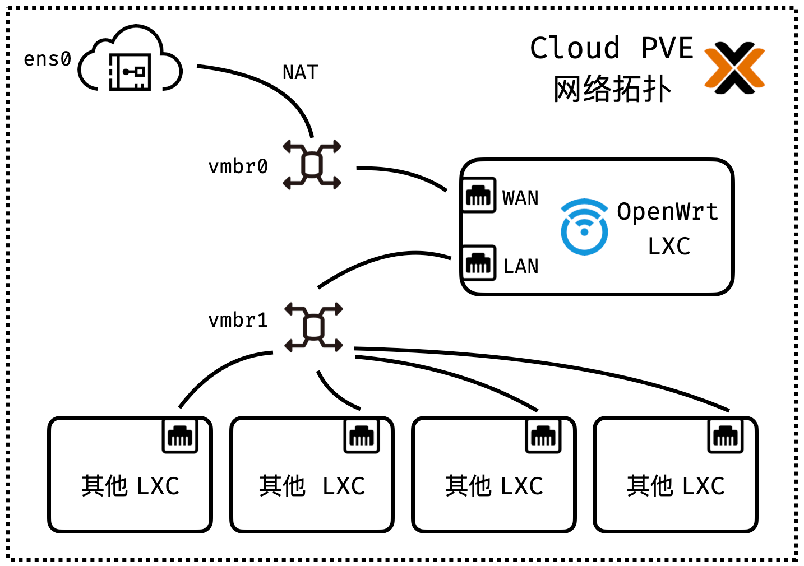
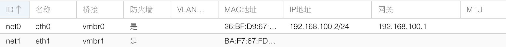
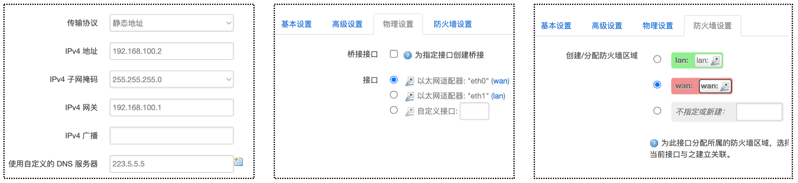
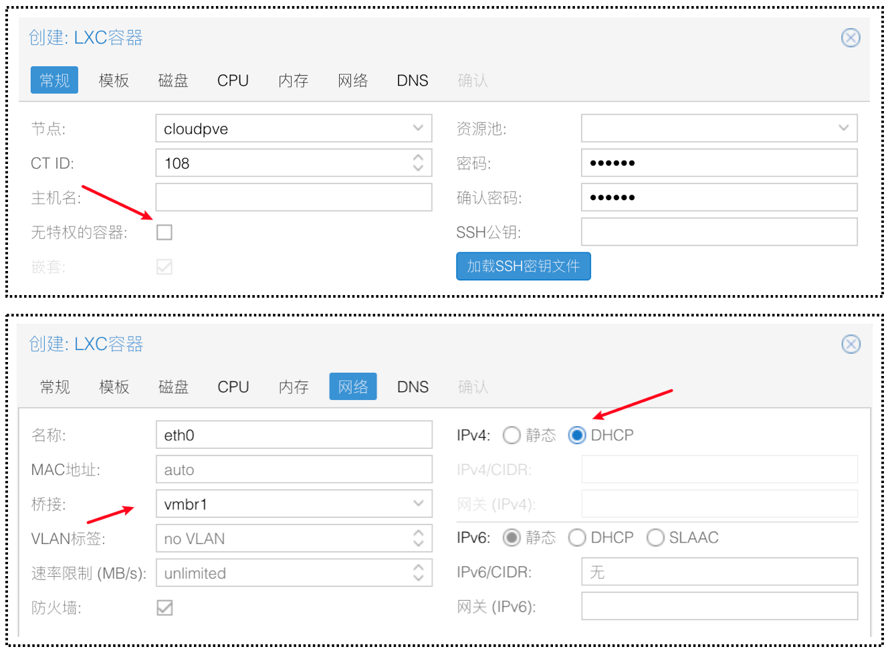
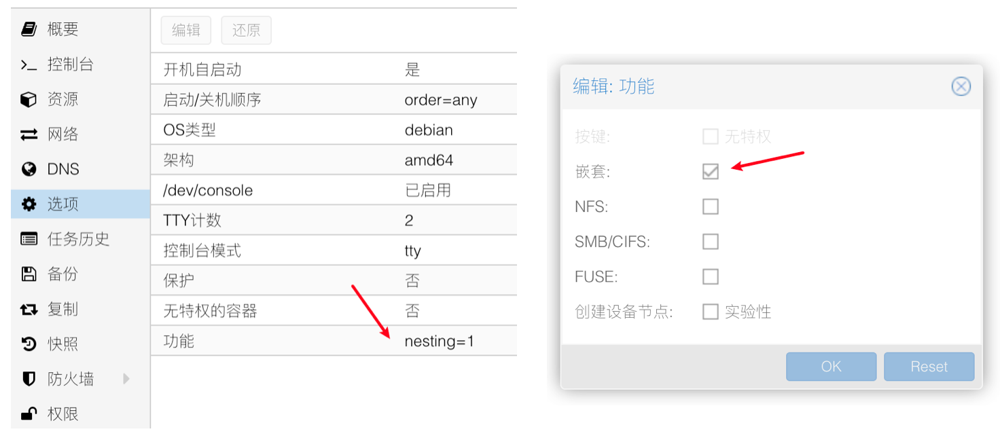

## Introduction

经常折腾服务器的同学对于 [Proxmox VE](https://www.proxmox.com/en/proxmox-ve) (Proxmox Virtual Environment，PVE) 想必不陌生，这个基于 debian 的虚拟化平台作为一个开源免费的方案，非常的好用。PVE 是一个完整的、开源的虚拟化服务器管理平台。它将 KVM 管理程序和 Linux Containers ([LXC](https://en.wikipedia.org/wiki/LXC))、 软件定义的存储和网络功能紧密集成在单个平台上。使用集成的基于 Web 的用户界面，使得用户可以轻松地管理虚拟机和容器。

之前我一直在思索如何更高效的利用囤积的 VPS，萌生了将 PVE 安装到云服务器 (VPS) 的想法。并在去年 10 月，我将这个方案 (**Cloud PVE**) 成功实现，并把个人的一些私有服务 (Self Hosted Services) 迁移到了在公有云上的 Cloud PVE。时隔 5 个月，距离写下本文我的 Cloud PVE 方案已经稳定运行了*148*天。说明该方案的稳定性有一定的保证，作为一个*个人的云服务器管理环境*，我觉得很不错，因此写下本文，分享一下这个方案。


具体来说，Cloud PVE 的个人云服务器配置方案有以下优缺点：

**优点：**

+ 充分利用 PVE 的 Web 界面，可以非常便捷的管理虚拟化环境。
+ 基于 LXC 可以对不同的服务创建各自的隔离环境。
+ 能够对云服务器进行更细粒度的资源分配。
+ 在国内的网络环境下，可以配置 OpenWrt in LXC，使 PVE 上的其他虚拟环境可以透明的科学上网。

**缺点：**


+ 由于大部分云服务器不支持[嵌套虚拟化](https://www.linux-kvm.org/page/Nested_Guests)，所以 Cloud PVE 只能管理和运行基于 LXC 的虚拟化方案。

+ PVE 本身占用内存占用略高 (1G 左右)，不适用于配置过低的云服务器。

本文之后的内容，将具体介绍一下该方案的一些实施细节。

## Install Proxmox VE

在云服务器上安装 PVE 的过程主要包括以下两步：

1. 将服务器的操作系统更换成 debian。
2. 根据[官方文档](https://pve.proxmox.com/wiki/Install_Proxmox_VE_on_Debian_Buster)，安装 PVE。

{}
在服务器上安装 debian 时，可以使用一些 dd scripts 来安装 debian 11，不要使用服务商提供的镜像。
{}

由于是在云服务器上安装 PVE，所以我们不能使用 [Proxmox VE Installer](https://pve.proxmox.com/wiki/Installation) 来安装 PVE，需要先安装 debian，之后在 debian 上安装 PVE。

**一些细节**

+ 安装 debian 11 时，请自行寻找信任的 dd 脚本将服务器更改成 debian 11。
+ 由于官方文档提供的 PVE 仓库源在国外，如果服务器在国内，为了提高下载速度，我们可以使用清华大学镜像站提供的 [PVE 镜像](https://mirrors.tuna.tsinghua.edu.cn/help/proxmox/)。
+ 为了保证可以连接上机器，官方文档中 **Create a Linux Bridge** 这一步不需要完成。

## Network Configuration

### 网络拓扑



如图为 Cloud PVE 的整体网络拓扑，为了实现环境的隔离和透明科学上网，使用 OpenWrt 作为其他容器的网关。其中：

+  `ens0` 是云服务器提供商分配的网卡 (可能是其他名称，例如我测试环境的 `ens5`)。
+ `vmbr0` 单独作为 OpenWrt 的 WAN，使用静态 IP。
+  `vmbr1` 作为 OpenWrt 的 LAN，提供 DHCP。

细心的同学可以发现，为了实现对 LXC 的网络流量的透明代理，这里进行了两次 NAT。由于服务器 IP 只有一个，其中一次 NAT 不可避免，而使用 OpenWrt 作为网关的 NAT 则是这个方案的代价。

### 1。配置 PVE

在 PVE 的网络设置中，分别创建 `vmbr0` 和 `vmbr1`，并为其指定 CIDR，CIDR 由个人喜好决定。


如图，在我的演示配置中：

+ `vmbr0` 的 CIDR 为 `192.168.100.1/24`，那么 OpenWrt 的 WAN IP 就可以指定为 `192.168.100.2/24`。
+ `vmbr1` 的 CIDR 为 `192.168.200.2/24`，那么 OpenWrt 的 LAN IP 就可以指定为 `192.168.200.1/24`，DHCP 分配的子网为 `192.168.200.0/24`，这里指定宿主机在 `vmbr1` 上的 IP 的作用是使得宿主机可以通过 `vmbr1` 直接访问 LXC。

### 2。配置 iptables

编辑 `/etc/network/interfaces`，在 `vmbr0` 的配置上添加 iptables 规则。(**注意，请确认子网范围和网卡名称和机器一致！**)

```shell
auto vmbr0
iface vmbr0 inet static
	address 192.168.100.1/24
	bridge-ports none
	bridge-stp off
	bridge-fd 0
	post-up iptables -t nat -A POSTROUTING -s '192.168.100.0/24' -o ens5 -j MASQUERADE
	post-down iptables -t nat -D POSTROUTING -s '192.168.100.0/24' -o ens5 -j MASQUERADE
```

### 3。配置内核转发

修改 `/etc/sysctl.conf`，取消以下行的注释。

```shell
net.ipv4.ip_forward = 1
```

执行 `sysctl -p` 使设置生效。

```bash
sysctl -p
```

### 测试

重启机器，创建 LXC，eth0 桥接 vmbr0，指定 CIDR 为 192.168.100.3/24，网关为 192.168.100.1，可以 ping 通公网 IP 和域名，即配置成功。

## OpenWrt in LXC

### 导入 OpenWrt

我使用的 GitHub 上他人构建的 [OpenWrt](https://doc.openwrt.cc/2-OpenWrt-Rpi/)，如果你能自己编译，应该也可以。选择 [rootfs](https://openwrt.cc/releases/targets/x86/64/immortalwrt-x86-64-generic-rootfs.tar.gz) 下载，并在 PVE 的命令行导入。

```bash
pct create 100 immortalwrt-x86-64-generic-rootfs.tar.gz \
--arch amd64 \
--hostname OpenWrt \
--rootfs local:8 \
--memory 512 \
--cores 2 \
--ostype unmanaged \
--unprivileged 1
```

### 添加网卡

在 OpenWrt 对应的 LXC 的网络配置中，添加如下配置。其中，`eth0` 对应 WAN，桥接到 `vmbr0`，`eth1` 对应 LAN，桥接到 `vmbr1`。



### 配置 LAN

启动 OpenWrt，修改 `/etc/config/network` 中的 lan 配置，修改 `ipaddr` 以及 `netmask`，删去 `option type 'bridge'`。

```txt
config interface 'lan'
        option ifname 'eth1'
        option proto 'static'
        option ipaddr '192.168.200.1'
        option netmask '255.255.255.0'
        option ip6assign '60'
```

重启 OpenWrt 使得网络配置生效 (可能需要在 PVE 的 Web 界面停止容器并重新启动)。

### 配置 WAN

使用 SSH 的端口转发，可以访问 OpenWrt 的 Web 界面。

```bash
ssh -L 8080:192.168.200.1:80 root@cloud_pve_ip_address
```

访问 `localhost:8080`，打开 OpenWrt 的 Web 管理界面，默认用户名为 root，密码为 password。

如图，添加 eth0 作为 wan 口，协议选择静态，CIDR 为 `192.168.100.2/24`，网关设置为 `192.168.100.1`。



## 创建其他容器





在创建其他 LXC 容器时，需要将容器的网卡桥接到 `vmbr1`，也就是 OpenWrt 的 LAN。在其他容器中测试网络联通行，可以成功 ping 通外界网络即配置成功。

**如果取消勾选无特权，并在功能中将 LXC 的嵌套功能打开，即可在 LXC 容器中使用 Docker。**

## Conclusion

自此，Cloud PVE 方案已经基本完成，通过创建不同 LXC 容器对不同服务进行隔离，对服务器资源进行更细粒度的划分。同时服务本身在云上，可以更便捷的通过云服务商的内网访问资源。但是对于**外界应该如何访问部署在内部 LXC 容器的服务 (内网穿透问题)**，本文仍然没有解决，我会在之后的博文给出我的解决方案。

{}
## Inspired by
+ [[OpenWrt Wiki] OpenWrt in LXC containers](https://openwrt.org/docs/guide-user/virtualization/lxc)
+ [Installing OpenWRT In Proxmox LXC – Virtualize Everything](https://virtualizeeverything.com/2022/05/23/setting-openwrt-in-proxmox-lxc/)
{}

