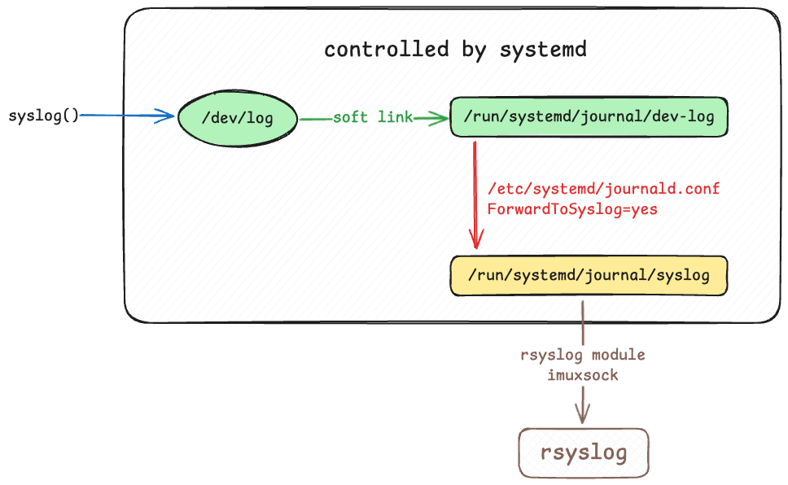

Systemd 的 Socket Activation（套接字激活）是一种按需启动服务的机制，其核心原理是：在客户端请求到来时，通过套接字（socket）触发服务的启动，而不需要预先运行服务。这种方式极大地节约了系统资源，同时优化了服务启动的效率。

{}

说是现在 Linux 系统，实际上只研究了 debian 系的，不过其他应该也大差不差吧（

{}

之所以了解到这个机制，是因为最近发现线上使用的 rsyslog 收集日志方案，在某些机器上会出现日志丢失的情况，为了搞清和解决这个问题，我开始研究现代 Linux 系统上 rsyslog 的收集日志的流程。

## rsyslog 日志写入流程

1. 应用程序调用 `syslog()`。
2. `syslog()` 函数将消息发送到 `/dev/log`:
   + `syslog()` 函数通过 Unix 套接字将日志消息发送到 `/dev/log`。
   + `/dev/log` 是一个符号链接，通常指向 `/run/systemd/journal/dev-log`，由 `systemd-journald` 监听。
3. `systemd-journald`接收消息：
   + `systemd-journald` 从 `/run/systemd/journal/dev-log` 套接字接收日志消息。
   + `systemd-journald` 处理并存储这些日志消息，通常存储在 `/run/log/journal/` 或 `/var/log/journal/` 中。
4. `systemd-journald` 转发消息到 `rsyslogd`:
   +  如果 `systemd-journald` 配置了 `ForwardToSyslog=yes`，它会将日志消息转发到 `/run/systemd/journal/syslog` 套接字。
   + `rsyslogd` 监听 `/run/systemd/journal/syslog` 套接字，接收并处理这些转发的日志消息。

整体流程如下图所示，经过这样一个流程，`rsyslogd` 的表现和没有 `systemd-journald` 介入时基本一致，`rsyslog` 能正确透明的读取到日志。



## 日志为什么会丢？

排查的过程比较曲折，最开始时怀疑 `rsylog` 其内部会丢失日志，但是通过一通排查，发现并不是这个问题。之后开始仔细研究`rsyslogd`的工作原理后，才了解到还有`systemd-journald` 这一层转发的存在。

了解了这一层转发机制后，通过查看线上日志，在业务高峰期间，`systemd-journald` 本身的运行日志会输出 `Forwarding to syslog missed XXX messages` 的日志，看来这就是丢失日志最初的源头，日志根本就没成功进入到 `rsyslog`!

{}

 下面代码片段只给出核心部分的代码，完整的代码会以链接形式在文中给出

{}

查看 `systemd-journald` 源码后发现，该日志实际上就是在转发日志时，遇到了 `EAGAIN` 错误，`systemd-journald` 只是简单的记录遇到的 `EAGAIN` 的次数，而不是按照 `EAGAIN` 正常的语意，进行重试。

1. 计数的[源代码](https://github.com/systemd/systemd/blob/59ea5e4c445f7ec80ef1800318843524cdc29a40/src/journal/journald-syslog.c#L84)如下，`systemd-journald` 会调用 `sendmsg()` 把收到的日志转发给 `/run/systemd/journald/syslog`, 当遇到 `EAGAIN` 报错时，将 `n_forward_syslog_missed` 变量累加。

```c
  /* Forward the syslog message we received via /dev/log to /run/systemd/syslog. Unfortunately we
   * currently can't set the SO_TIMESTAMP auxiliary data, and hence we don't. */

  if (sendmsg(s->syslog_fd, &msghdr, MSG_NOSIGNAL) >= 0)
          return;

  /* The socket is full? I guess the syslog implementation is
   * too slow, and we shouldn't wait for that... */
  if (errno == EAGAIN) {
          s->n_forward_syslog_missed++;
          return;
  }
```

2. 输出日志的[源代码](https://github.com/systemd/systemd/blob/59ea5e4c445f7ec80ef1800318843524cdc29a40/src/journal/journald-syslog.c#L525)如下，`systemd-journald` 会定期输出 `n_forward_syslog_missed` 的值（实际上就是 `EAGAIN` 的次数），并以 `Forwarding to syslog missed %u messages` 格式输出。

```c
void server_maybe_warn_forward_syslog_missed(Server *s) {
        usec_t n;

        assert(s);

        if (s->n_forward_syslog_missed <= 0)
                return;

        n = now(CLOCK_MONOTONIC);
        if (s->last_warn_forward_syslog_missed + WARN_FORWARD_SYSLOG_MISSED_USEC > n)
                return;

        server_driver_message(s, 0,
                              "MESSAGE_ID=" SD_MESSAGE_FORWARD_SYSLOG_MISSED_STR,
                              LOG_MESSAGE("Forwarding to syslog missed %u messages.",
                                          s->n_forward_syslog_missed),
                              NULL);

        s->n_forward_syslog_missed = 0;
        s->last_warn_forward_syslog_missed = n;
}
```

### 什么情况下会遇到 EAGAIN？

> EAGAIN 在 man 手册中给出的解释是：Resource temporarily unavailable (may be the same value as EWOULDBLOCK) (POSIX.1-2001). 在使用 Unix 套接字进行通信时，如果发送操作返回 `EAGAIN` 错误，通常表示套接字的发送缓冲区已满，并且套接字被设置为**非阻塞模式**。在这种情况下，发送操作不会阻塞，而是立即返回 `EAGAIN` 错误，提示调用者稍后重试。

遇到 `EAGAIN` 错误，表明该 socket 的缓冲区已满，说明 `rsyslog` 从 `socket` 读取消息的处理能力无法跟上`systemd-journald` 的转发速度。

正常情况下，遇到 `EAGAIN` 错误时，写入端需要重试写入。然而 `systemd-journald` 看起来并不打算重试，而是仅记录遇到的错误次数并输出日志。`EAGAIN` 似乎无法完全避免，但增大该 unix socket 的发送缓冲区大小来降低其发生的概率显然是一个可行的尝试方案。

## 调整缓冲区大小不生效？

那么现在的问题是如何调整 Unix socket 的缓冲区，查阅资料得知，通过 `setsockopt()` 函数可以调整套接字的缓冲区大小，同时也受到以下几个内核参数的限制：

- `net.core.rmem_default`：接收缓冲区的默认大小
- `net.core.wmem_default`：发送缓冲区的默认大小
- `net.core.rmem_max`：接收缓冲区的最大大小
- `net.core.wmem_max`：发送缓冲区的最大大小

在调整相关参数之后，我自信满满地重启了`systemd-journald` 和 `rsyslogd` 并进行测试和观察，不管我怎么调整，测试表现都没什么区别，就好像参数调整完全对其没有生效一样。后来进一步探索后发现，实际上，这里有两个问题；

1. 根据 [Unix.7](https://man7.org/linux/man-pages/man7/unix.7.html) 手册中的描述，SO_RCVBUF 的调整对 UNIX domain sockets 毫无意义，即使在我的测试例程中，可以正常的设置和读取新的值，但是却是无效的。

   >  The SO_SNDBUF socket option does have an effect for UNIX domain sockets, **but the SO_RCVBUF option does not**.  For datagram sockets, the SO_SNDBUF value imposes an upper limit on the size of outgoing datagrams.  This limit is calculated as the doubled (see socket(7)) option value less 32 bytes used for overhead.

   {}

   最终确实通过增大这个参数，成功解决了  rsyslog 丢失日志的问题，但不是此文的重点，就不多展开了

   {}

   此时需要调整的是内核的另一参数 `net.unix.max_dgram_qlen` ,它控制数据报（datagram）套接字的最大队列长度，它决定了在接收缓冲区已满时，最多可以排队等待处理的数据报数量。

2. 重启 `systemd-journald` 和 `rsyslogd` 这两个进程这两个进程并不会导致 socket 的重新创建，查看 `/run/systemd/journal` 下的几个 unix socket，发现其创建时间和这两个进程的重启时间无关，这表明重启这两个进程并不会使得该 Socket 重新创建，这其中的魔法就是后文要讲到的的 `socket activation`。

## Socket Activation

扯了这么久，才提到了本文的标题内容，Systemd 的 socket activation 机制。正如文章开头所提到的那样，Systemd 的 Socket Activation（套接字激活）是一种按需启动服务的机制。

简单来说，服务所需的 socket 由 systemd 预先创建并监听，作为一种“懒加载”策略。只有当该 socket 收到实际请求时，systemd 才会启动对应的服务进程，并将预创建的 socket 传递给服务。服务进程不需要重新创建 socket，而是直接使用 systemd 提供的 socket，并对其上的消息作出响应。这种机制要求服务的进程具备相应的适配能力，以接收和处理由 systemd 传递的 socket。

我们先来看下 `/run/systemd/journal/syslog` 真正创建的地方，正是 `systemd` 的这个 `syslog.socket` 单元，其配置文件如下。比较核心的关键字段是

- `ListenDatagram=/run/systemd/journal/syslog`：监听 `/run/systemd/journal/syslog` 路径上的数据报类型的 Unix 套接字。

```ini
[Unit]
Description=Syslog Socket
Documentation=man:systemd.special(7)
Documentation=https://www.freedesktop.org/wiki/Software/systemd/syslog
DefaultDependencies=no
Before=sockets.target

# Don't allow logging until the very end
Conflicts=shutdown.target
Before=shutdown.target

# Don't try to activate syslog.service if sysinit.target has failed.
Conflicts=emergency.service
Before=emergency.service

[Socket]
ListenDatagram=/run/systemd/journal/syslog
SocketMode=0666
PassCredentials=yes
PassSecurity=yes
ReceiveBuffer=8M
```

根据[文档](https://www.freedesktop.org/software/systemd/man/latest/systemd.socket.html):

> For each socket unit, a matching service unit must exist, describing the service to start on incoming traffic on the socket (see [systemd.service(5)](https://www.freedesktop.org/software/systemd/man/latest/systemd.service.html#) for more information about .service units). The name of the .service unit is by default the same as the name of the .socket unit, but can be altered with the `Service=` option described below. 
>
> 对于每个套接字单元，必须存在一个匹配的服务单元，用于描述在套接字上启动的服务的详细信息（有关.service 单元的更多信息，请参阅[systemd.service(5)](https://www.freedesktop.org/software/systemd/man/latest/systemd.service.html#)）。默认情况下，.service 单元的名称与.socket 单元的名称相同，但可以通过下面的`Service=`选项进行修改。

因此我们寻找一下 `syslog.service` 这个配置文件，果然其指向了 `rsyslog` 的 systemd 配置文件，其内容如下，关键的配置项是

- `Requires=syslog.socket`：指定该服务依赖于 `syslog.socket`，即在启动该服务之前必须启动 `syslog.socket`。

```ini
[Unit]
Description=System Logging Service
Requires=syslog.socket
Documentation=man:rsyslogd(8)
Documentation=http://www.rsyslog.com/doc/

[Service]
Type=notify
ExecStart=/usr/sbin/rsyslogd -n
StandardOutput=null
Restart=on-failure

[Install]
WantedBy=multi-user.target
Alias=syslog.service
```

自此，前文提到的如何重新创建  `/run/systemd/journal/syslog` 这个 socket 的问题也得到了解决，重启 `syslog.socket` 这个单元即可，经测试，对 `net.unix.max_dgram_qlen` ，果然生效。

## Socket Activation 的原理

光知道 Socket Activation 这个机制那可不够，我的好奇心之火正熊熊燃烧，与此同时我心中对其实现机制也有了模糊的猜测，需要经过对源代码的一番审阅，才能得到验证。

{}

其实我最开始的图中展示的那几个 socket 也是这么创建的，涉及的另一个 socket 单元是 `systemd-journald-dev-log.socket`

{}

不过还不着急，我们先来看下进程要如何接收 `systemd` 传递过来的 socket。正好，我们以 `rsyslog` 举例，看看它是如果接收 systemd 传递过来的 socket 的的。

rsyslog 首先通过[调用](https://github.com/rsyslog/rsyslog/blob/c61de6093ca310099f74e3cef4353b085c482474/plugins/imuxsock/imuxsock.c#L1208) `sd_listen_fds(0)`，拿到 systemd 激活 (systemd activated) 的套接字数量，然后遍历检查是否是[符合条件](https://github.com/rsyslog/rsyslog/blob/c61de6093ca310099f74e3cef4353b085c482474/plugins/imuxsock/imuxsock.c#L567)的 socket，如果是，则直接使用。`SD_LISTEN_FDS_START` 是 systemd 提供的一个宏，用于在服务进程中获取由 systemd 传递的文件描述符，这个宏定义在 `sd-daemon.h` 头文件中。

```c
sd_fds = sd_listen_fds(0);
if(sd_fds < 0) {
  LogError(-sd_fds, NO_ERRCODE, "imuxsock: Failed to acquire systemd socket");
  ABORT_FINALIZE(RS_RET_ERR_CRE_AFUX);
}

/* 省略部分其他代码 */

if (sd_fds > 0) {
  /* Check if the current socket is a systemd activated one.
   * If so, just use it.
   */
  int fd;

  for (fd = SD_LISTEN_FDS_START; fd < SD_LISTEN_FDS_START + sd_fds; fd++) {
    if( sd_is_socket_unix(fd, SOCK_DGRAM, -1, (const char*) pLstn->sockName, 0) == 1) {
      /* ok, it matches -- just use as is */
      pLstn->fd = fd;

      LogMsg(0, NO_ERRCODE, LOG_INFO,
        "imuxsock: Acquired UNIX socket '%s' (fd %d) from systemd.\n",
        pLstn->sockName, pLstn->fd);
      break;
    }
  }
}
```

这里的有一个关键的库函数是 `sd_listen_fds()`, 查看其[手册](https://www.freedesktop.org/software/systemd/man/latest/sd_listen_fds.html)，我们可以知道 `sd_listen_fds()` 是 systemd 提供的一个函数，用于获取由 systemd 传递给服务进程的文件描述符个数。得到个数之后，我们就可以从 `SD_LISTEN_FDS_START` 开始遍历，正如同 rsyslog 展示的代码中所做的那样，检查传入的 fd 是否符合条件，并直接使用。

`systemd-journald` 源码中也是类似的使用方法，这里也就不多赘述，相关源代码的[链接在这](https://github.com/systemd/systemd/blob/180761d2d0705e82635027c1c2ace1bbed383e1e/src/journal/journald-server.c#L2711), 有兴趣的读者可以自行查看。

### 系统调用 fork() & exec()

根据上面的说明，我想朋友们已经和我有了差不多的猜测：

{}

我想此时 systemd 应该不会去设置`FD_CLOEXEC`，关于 `FD_CLOEXEC` 还有些个有意思的漏洞，例如 [CVE-2024-21626](https://www.manjusaka.blog/posts/2024/02/10/CVE-2024-21626/)

{}

我们知道，当 fork() 创建一个子进程时，将继承了父进程打开的所有文件描述符，那么自然也包括之前预先创建的 socket 的 fd，之后再执行 exec() 执行其他进程时，这个 socket 对应的 fd 也会被继承，从而实现所谓的 socket activation。更细节一些的话就是：

1. systemd 根据配置文件，打开套接字。
2. 当服务需要启动时，systemd 使用 `fork()` 创建一个子进程。这个子进程继承了父进程（systemd）打开的文件描述符，包括预先创建的套接字的文件描述符。
3. 每个服务要求的文件描述符不同，子进程在 exec()  之前，对文件描述符进行了调整，使得服务只能看到其要求的文件描述符。

1. 子进程调用 `exec()` 执行服务的可执行文件，新的服务进程可以访问这些套接字。
2. 服务进程使用 `sd_listen_fds()` 函数获取传递的文件描述符，并开始处理来自这些套接字的连接或数据。

以上是我推测的大概流程，Systemd 目前已经有 100 万行以上的代码了，不用想都是非常复杂的，如果想理清源码中的流程，估计不大轻松，更别说还有各种其他的细节纠缠在其中。不过好在 systemd 提供了一个专门用来测试 socket activation 的[命令](https://www.freedesktop.org/software/systemd/man/latest/systemd-socket-activate.html) `systemd-socket-activate` ，这个命令的相关[源码](https://github.com/systemd/systemd/blob/aed18d7e9a4811f941c149c5d96cb3cc428a3430/src/socket-activate/socket-activate.c#L1)就少多了，可以供我们一窥其实现。

## 写在最后

我从 rsyslog 丢失日志的问题入手，弄清了现代 Linux 系统中 rsyslog 接收日志的完整流程。为了调整 rsyslog 接收日志时所用 socket 的接收队列的大小，又进一步研究了 systemd 的 Socket Activation 机制。这一探索过程并不像文字描述得那么顺利，期间经历了不少波折。但庆幸的是，这次摸索让我收获颇丰，过程中也有许多文档、文章和源代码为我提供了极大的帮助。

值得一提的是，Socket Activation 机制不仅仅是为了“懒加载”服务，其更大的价值在于提升 Linux 系统的启动效率。通过预先创建 socket，这一机制打破了传统服务启动顺序的依赖关系，实现了多个服务的并行启动。同时，它还为服务的重启和更新提供了更灵活的支持。虽然这一理念并非 systemd 的首创，但毫无疑问，systemd 将其发扬光大。

如果你对这部分内容感兴趣，不妨参考文末引用的 systemd 官方文章，文中详细讲述了 Socket Activation 的设计理念和初衷，也给我了极大的启发。

## Inspired By

{}

+ [Socket Activation](https://0pointer.de/blog/projects/socket-activation.html)
+ [Socket Activation, Part II](https://0pointer.de/blog/projects/socket-activation2.html)

{}
