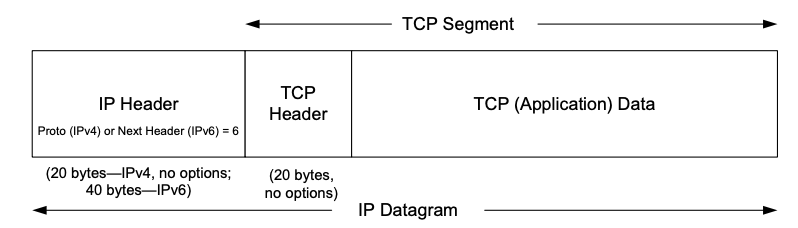
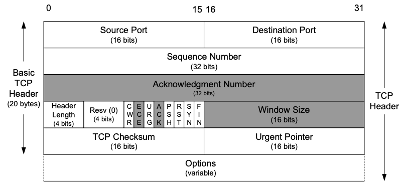
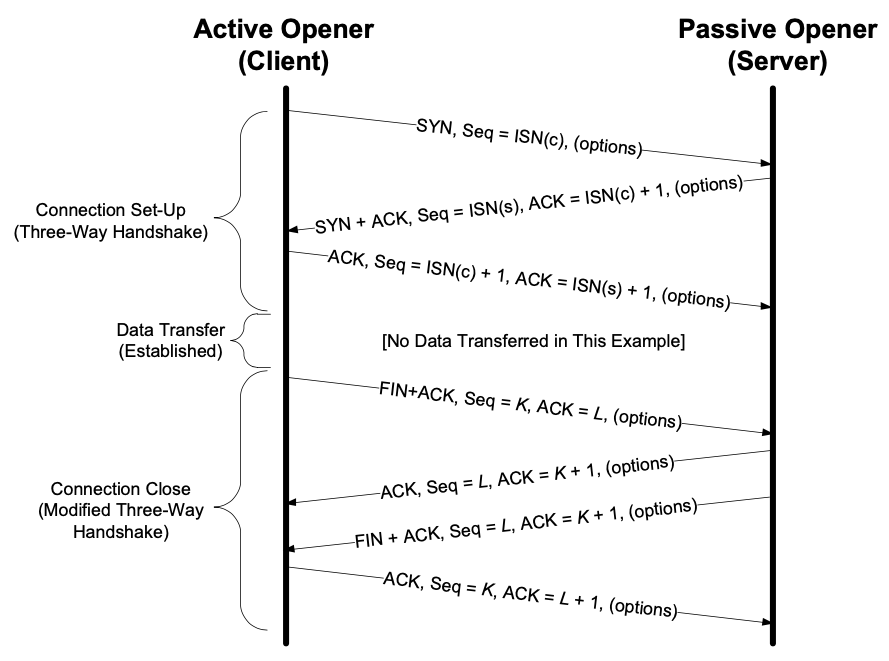
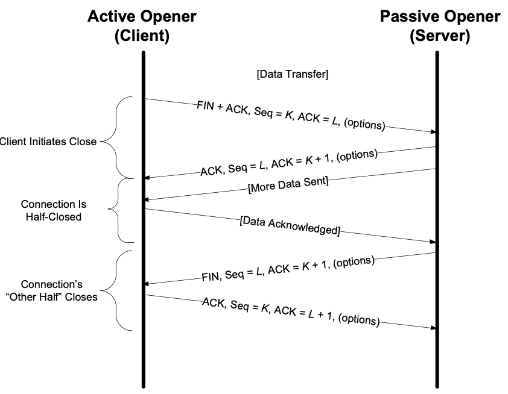
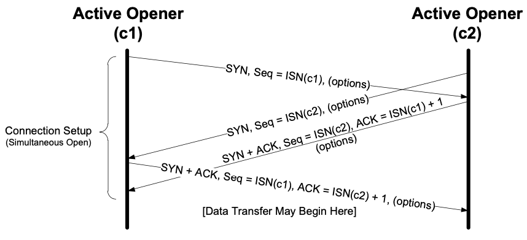
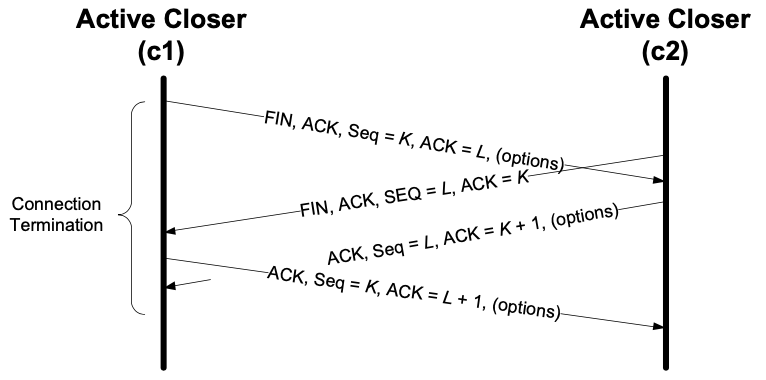

最近看了 `TCP/IP Illustrate Volume I` 的 Chapter 12 和 Charpter 13，对这部分进行一个总结和复习。

## TCP  Basic

TCP provides a *connection-oriented*, reliable, byte stream service. The term *connection- oriented* means that the two applications using TCP must establish a TCP connec- tion by contacting each other before they can exchange data.

Because it provides a byte stream interface, TCP must convert a sending application’s stream of bytes into a set of packets that IP can carry. This is called *packetization*. 

The chunk passed by TCP to IP is called a *segment*.

TCP provides a *full-duplex* service to the application layer.

### TCP Header and Encapsulation

The TCP header appears immediately following the IP header or last IPv6 extension header and is often 20 bytes long (with no TCP options). With options, the TCP header can be as large as 60 bytes. Common options include Maximum Segment Size, Time- stamps, Window Scaling, and Selective ACKs.

The TCP header. Its normal size is 20 bytes, unless options are present. The *Header Length* field gives the size of the header in 32-bit words (minimum value is 5). The shaded fields (*Acknowledgment Number*, *Window Size*, plus *ECE* and *ACK* bits) refer to the data flowing in the opposite direction relative to the sender of this segment.

## TCP Connection Management

### TCP Connection Establishment and Termination

Usually, the client initiates a three-way handshake to exchange initial sequence numbers carried on SYN segments for the client and server (ISN(c) and ISN(s), respectively). The connection terminates after each side has sent a FIN and received an acknowledgment for it.

### TCP Connection Establishment（握手）

1. The *active opener* (normally called the client) sends a SYN segment (i.e., a TCP/IP packet with the *SYN* bit field turned on in the TCP header) specify- ing the port number of the peer to which it wants to connect and the client’s initial sequence number or ISN(c). It typically sends one or more options at this point. This is segment 1.
2. The server responds with its own SYN segment containing its initial sequence number (ISN(s)). This is segment 2. The server also acknowledges the client’s SYN by ACKing ISN(c) plus 1. A SYN consumes one sequence number and is retransmitted if lost.
3. The client must acknowledge this SYN from the server by ACKing ISN(s) plus 1. This is segment 3.

> **TCP supports the capability of carrying application data on SYN segments. This is rarely used, however, because the Berkeley sockets API does not support it.** **RFC里的TCP是可以在SYN Segment里面传递数据的，但是很少见，因为 Berkeley Sockets API 不支持。**

### TCP Connection Termination（挥手）

1. The *active closer* sends a FIN segment specifying the current sequence number the receiver expects to see (*K* in Figure). The FIN also includes an ACK for the last data sent in the other direction (labeled *L* in Figure).
2. The *passive closer* responds by ACKing value *K* + 1 to indicate its successful receipt of the active closer’s FIN. At this point, the application is notified that the other end of its connection has performed a close. Typically this results in the application initiating its own close operation. The passive closer then effectively becomes another active closer and sends its own FIN. The sequence number is equal to *L*.
3. To complete the close, the final segment contains an ACK for the last FIN. Note that if a FIN is lost, it is retransmitted until an ACK for it is received.

### TCP Half-Close

TCP 半关闭状态，有一端数据没发完，所以当这一端收到对端的`FIN Segment`时，先确认对方的FIN，但是自己这边还是继续发数据，发完之后再发自己这端的`FIN Segment`。其他过程和正常的挥手没有区别。

### Simultaneous Open and Close （TCP的同时打开和关闭）

TCP同时打开，需要交换4个Segment，而不是正常握手的3个，这时候双方都既作`active opener`又做`passive openner`。

TCP的同时关闭和正常的关闭区别不大。只不过，在这种情况下，两端都是`active closer`。

## Reference

[TCP/IP Illustrated, Volume 1 The Protocol - Kevin R. Fall](https://www.oreilly.com/library/view/tcpip-illustrated-volume/9780132808200/)
