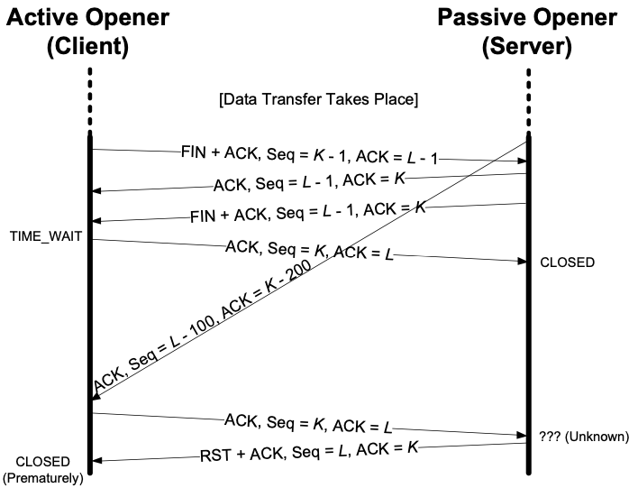

In general，a reset is sent by TCP whenever a segment arrives that does **not appear to be correct** for the **referenced connection**。the term *referenced connection* measn the connection specified by the 4-tuple in the TCP and IP headers of the reset。Resets ordinarily result in a fast teardown of a TCP connection。

在 TCP 协议中，RST 用来关闭异常的连接。在 TCP 的设计中它是不可或缺的。

For a reset segment to be accepted by a TCP，**the *ACK* bit field must be set and the *ACK Number* field must be within the valid window**。This helps to prevent a simple attack in which anyone able to generate a reset matching the appropriate connection (4-tuple) could disrupt a connection [RFC5961]。

收到的 RST 必须要设置了 ACK 而且 ACK 合法。

## 几种会触发 RST 的情况

1. Connection Request to Nonexistent Port (连接到不存在的端口)

    > A common case for generating a reset segment is when a connection request arrives and no process is listening on the destination port。
    >
    > 目标端口不存在时，发送者会收到 RST。

2. Aborting a Connection (终止一条连接)

    > Aborting a connection provides two features to the application：
    >
    > (1) any queued data is thrown away and a reset segment is sent immediately。
    >
    > 在缓冲区的数据会被丢弃。
    >
    > (2) the receiver of the reset can tell that the other end did an abort instead of a normal close。The API being used by the application must provide a way to generate the abort instead of a normal close。
    >
    > 接收者要知道这是一条异常终止的连接。

3. Half-Open Connections (半打开连接发送数据)

    > A TCP connection is said to be *half-open* if one end has closed or aborted the connection without the knowledge of the other end.This can happen anytime one of the peers crashes。As long as there is no attempt to transfer data across a half-open connection，the end that is still up does not detect that the other end has crashed。
    >
    > TCP 的半打开状态，指的是在 TCP 连接建立之后，有一端掉电或程序崩溃，但是另外一端不知道，还以为对方和自己一样都是 `ESTABLISHED`，这时就是处在半打开状态。
    >
    > 半打开会触发 RST，应该是指，处于半打开状态的一端在对端恢复之后按照之前的协商发送 Segment 的话，因为对端重启丢失了这个信息，对它来讲，这是一着异常连接，所以会发送一个 RST。

4. TIME-WAIT Assassination (TWA) (暗杀)

    > An RST segment can “assassinate” the TIME_WAIT state and force the connection to close prematurely。Various methods exist to resist this problem，including ignoring RST segments when in the TIME_WAIT state。
    >
    > 

## 其他

网上资料提到很多会触发 RST 的具体情景，我觉得大部分可以概括进 1，2 两种情况，关于这部分，放在参考资料里。

## Reference

[TCP/IP Illustrated，Volume 1 The Protocol - Kevin R。Fall](https://www.oreilly.com/library/view/tcpip-illustrated-volume/9780132808200/)

[tcp rst 产生的几种情况](https://zhuanlan.zhihu.com/p/30791159)

[浅谈 tcp 的半打开连接](https://zhuanlan.zhihu.com/p/32081783)
