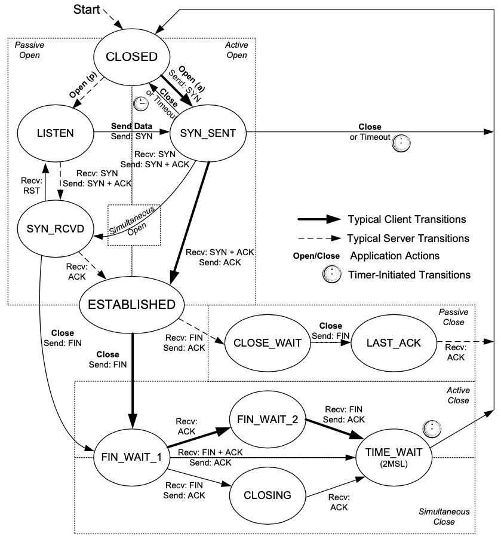

TCP 的状态转换非常经典，最近学习了 TCP/IP Illustrate Volume I Chapter 13 中关于这部分的内容，在此记录一下。

## TCP State Transition Diagram



+ 粗黑实线的箭头表示 `client` 的典型状态转换
+ 黑色虚线箭头表示 `server` 的典型状态转换

### TIME_WAIT (2MSL Wait) State

```bash
sysctl -a | grep tcp_fin_timeout
net.ipv4.tcp_fin_timeout = 60
```

2MSL 的意义：

+ When TCP performs an active close and sends the final ACK，that connection must stay in the TIME_WAIT state for twice the MSL。This lets TCP resend the final ACK in case it is lost。The final ACK is resent not because the TCP retransmits ACKs (they do not consume sequence numbers and are not retransmitted by TCP)，but because the other side will retransmit its FIN (which does consume a sequence number)。Indeed，TCP will always retransmit FINs until it receives a final ACK。
+ The 2MSL wait provides protection against delayed segments from an earlier instantiation of a connection being interpreted as part of a new connection that uses the same local and foreign IP addresses and port numbers。

### FIN_WAIT_2 State

当主动关闭连接的那一方发送完它的 FIN 并且收到对端的 ACK 之后，会进入 FIN_WAIT_2 状态，这时候，如果收到对端的 FIN，才会进入到 TIME_WAIT 状态，但是，存在一种情况就是对端一直不发送 FIN，就会导致自身一直停留在 FIN_WAIT_2，而对端一直停留在 CLOSE_WAIT，直到对端决定关闭连接。

Many implementations prevent this infinite wait in the FIN_WAIT_2 state as follows：If the application that does the active close does a complete close，**not a half-close** indicating that it expects to receive data，a timer is set。**If the connection is idle when the timer expires，TCP moves the connection into the CLOSED state。**In Linux，the variable net.ipv4.tcp_fin_timeout can be adjusted to control the number of seconds to which the timer is set。Its default value is 60s。

### Simultaneous Close

For a simultaneous close，in terms of Figure，both ends go from ESTABLISHED to FIN_WAIT_1 when the application issues the close。This causes both FINs to be sent，and they probably pass each other somewhere in the network。When its peer’s FIN arrives，each end transitions from FIN_WAIT_1 to the CLOS- ING state，and each endpoint sends its final ACK。**Upon receiving a final ACK，each endpoint’s state changes to TIME_WAIT，and the 2MSL wait is initiated。**

TCP 同时关闭的时候，两端都会进入 TIME_WAIT，并且要等待 2MSL。

## Reference

[TCP/IP Illustrated，Volume 1 The Protocol - Kevin R。Fall](https://www.oreilly.com/library/view/tcpip-illustrated-volume/9780132808200/)
